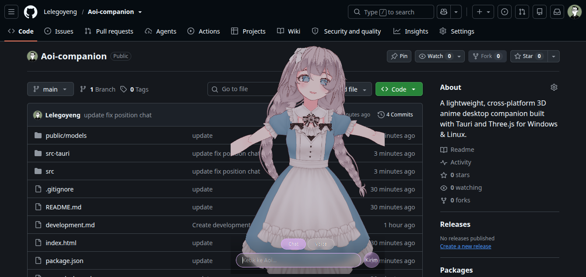

# Aoi - 3D Anime Companion



**Aoi** adalah desktop companion berupa karakter 3D anime wanita yang bisa diajak bicara (voice) atau mengetik (chat). Aoi akan merespons dengan **bubble chat** di samping kepala atau **bersuara** tergantung pengaturan mode.

## Fitur Utama

- **Karakter 3D Anime Wanita** bernama **Aoi**
- **Interaksi via Chat (ketik)** - User mengetik pesan, Aoi membalas dengan bubble chat
- **Interaksi via Voice** - User berbicara, Aoi membalas dengan suara
- **Bubble Chat** - Respon teks muncul sebagai bubble di samping kepala Aoi
- **Voice Response** - Respon suara langsung diputar
- **Mode fleksibel** - Pengguna bisa memilih bubble chat, suara, atau keduanya
- **Cross-platform** - Berjalan di **Linux** dan **Windows**

## Tech Stack

| Komponen | Teknologi |
|----------|-----------|
| Desktop App | [Tauri](https://tauri.app/) (Rust backend + WebView frontend) |
| 3D Rendering | [Three.js](https://threejs.org/) |
| 3D Model | VRoid Studio / Mixamo (format `.glb` / `.gltf`) |
| AI Backend | AI API Key (OpenAI / LLM lainnya) |
| Speech-to-Text | Web Speech API / Whisper API |
| Text-to-Speech | Web Speech API / external TTS |

## Status Pengembangan

Saat ini fokus pada pembuatan **karakter 3D Aoi** terlebih dahulu sebelum integrasi AI.

## Struktur Project

```text
Aoi-companion/
├── index.html
├── package.json
├── vite.config.js
├── public/
│   └── models/           # Taruh file .glb/.gltf di sini
├── src/
│   ├── main.js           # Entry point
│   ├── style.css         # Styles & chat bubble UI
│   ├── scene.js          # Three.js scene setup
│   ├── character.js      # 3D character (placeholder + model loader)
│   ├── chat.js           # Bubble chat system
│   └── speech.js         # Speech-to-Text & Text-to-Speech
└── src-tauri/
    ├── Cargo.toml
    ├── tauri.conf.json
    └── src/main.rs        # Tauri backend
```

## Getting Started

### Prerequisites

- [Node.js](https://nodejs.org/) (v18+)
- [Rust](https://www.rust-lang.org/tools/install) (untuk Tauri)
- Tauri system dependencies:
  - **Linux**: `sudo apt install libwebkit2gtk-4.1-dev build-essential curl wget file libxdo-dev libssl-dev libayatana-appindicator3-dev librsvg2-dev`
  - **Windows**: Install [Visual Studio Build Tools](https://visualstudio.microsoft.com/visual-cpp-build-tools/) dengan workload "Desktop development with C++"

### Install & Run

```bash
# Install dependencies
pnpm install

# Run dalam mode development (browser)
pnpm run dev

# Run sebagai desktop app (Tauri)
pnpm run tauri dev

# Build untuk produksi (Linux)
pnpm run tauri build
```

### Build Windows dari Linux (NSIS)

Untuk membangun installer Windows dari sistem Linux, gunakan NSIS:

```bash
# 1. Install NSIS
sudo apt install -y nsis

# 2. Build dengan bundler NSIS
pnpm run tauri build --target x86_64-pc-windows-gnu --bundles nsis
```

Output file:
- **Installer NSIS**: `src-tauri/target/x86_64-pc-windows-gnu/release/bundle/nsis/Aoi Companion_0.1.0_x64-setup.exe`

## Mengganti Model Karakter

1. Buat model 3D Aoi menggunakan **VRoid Studio** atau tools lainnya.
2. Export dalam format `.vrm` (recommended) atau `.glb`/`.gltf`.
3. Taruh file model di `public/models/character1.vrm`.
4. Model akan otomatis load saat aplikasi dijalankan.
5. Jika VRM gagal load, placeholder character akan digunakan sebagai fallback.

## Roadmap

- [x] Placeholder character (Three.js primitives)
- [x] Chat bubble system
- [x] Voice mode (STT + TTS)
- [x] Cross-platform (Linux + Windows via Tauri)
- [ ] 3D model Aoi yang sesungguhnya
- [ ] Animasi Idle, Talking, Waving
- [ ] Integrasi AI API Key
- [ ] Respons cerdas dari AI
- [ ] Drag & drop window

## License

Belum ditentukan.
